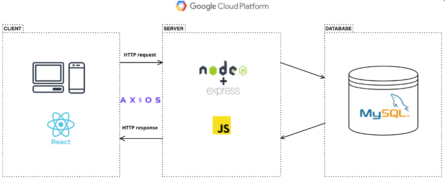

# Climate Change Data Visualization Application

## The project developers
The project is developed by the second-year Information Technology students from Oulu University of Applied Sciences: 
-	**Elias Linna**, [GitHub account](https://github.com/eliastom)
-	**Nenna-Leena Hänninen**, [GitHub account](https://github.com/nennahanninen)
-	**Yinan Li**, [GitHub account](https://github.com/YinanLi1987)

We have been working together throughout the whole project and everyone has been equally involved in all the parts of the development process.

## Introduction of the project
This project is about creating a climate change data visualization application as part of the Advanced Web Applications Project-course. Eight charts show historical global temperature and CO2 changes in diverse ways. The user can create an account and login to the application. The user can then make customized views by including various charts, customized descriptions and share the link to these views with public and unique URLs. The finished application will be available on the public internet.

## Description of the project
The project has been developed by following Agile software development method and Kanban framework template in GitHub Projects has been used to implement it. Communication of our team has been constant throughout the project and the project progressed as expected. Our team has been meeting evenly on campus and remotely on Teams. Also, teacher meetings have been held weekly and everybody has been able to attend. Overall, our team has been self-organizing, communicative, and able to deliver well-functioning application based on the project requirements.

## Technologies used in the project
-	User Interface: 
    - **HTML & CSS**
    - [**Bootstrap**](https://github.com/twbs/bootstrap#readme) 5.2.2
    - [**React Bootstrap**](https://react-bootstrap.github.io/) 2.6.0

-	Front-end Framework:
    - [**React.js**](https://reactjs.org/) 18.2.0

-	Back-end: 
    - [**Node.js**](https://nodejs.org/en/) 19.0.1
    - [**Express.js**](https://github.com/expressjs/express) 4.18.2
    - [**Axios.js**](https://github.com/axios/axios#readme) 1.1.3

-	Database:
    - [**MySQL**](https://www.mysql.com/) 8.0.31

-	Data visualization:
    - [**Chart.js**](https://www.chartjs.org/) 3.9.1
    - [**react-chartjs-2**](https://github.com/reactchartjs/react-chartjs-2#readme) 4.3.1

-	Deployment:
    - [**Google Cloud Platform**](https://cloud.google.com/)

## Tools used in the project
-	UI design tool: [**Figma**](https://www.figma.com/)
-	Code editor: [**Visual Studio Code**](https://code.visualstudio.com/)
-	Database design tool: [**MySQL Workbench**](https://www.mysql.com/products/workbench/)
-	Version control: [**Git**](https://git-scm.com/) **&** [**GitHub**](https://github.com/)

## The architecture of the application



## Interface description
The application consists of different views and Signup/Login functionality. These can be accessed through the navigation bar on top of the page:
1.	Atmospheric CO2 and temperatures: 6 different kind of line charts displaying diverse climate change data
2.	Emission sources: Line chart and doughnut chart displaying CO2 emissions data
3.	Create a custom view: 
    - This view can only be accessed as a logged in user
    - User can create custom views including any of the available charts and include custom descriptions for them
    - User can choose between two layouts, one column layout or two column layout
    - One user can have many created visualization views with unique URL tags
    - User can delete the visualization views created
4.	User-specific visualization view: 
    - This view is accessible without logging in and has a public address
5.	Signup/Login
    - A user is created by entering an email, username and password, which then enables logging in to the application
    - The user is able to delete the user
    - Deleting the user also deletes all visualization views of the user

> Smallest supported window size is 600px horizontal.

## How to install and use the application (locally)
**Step one:** 

Download the project / clone the project repository
 
**Step two:** 

Within the root folder, install the following dependencies:
- [**Axios.js**](https://github.com/axios/axios#readme) 1.1.3
- [**Chart.js**](https://www.chartjs.org/) 3.9.1
- [**react-chartjs-2**](https://github.com/reactchartjs/react-chartjs-2#readme) 4.3.1
- [**jwt-decode**](https://github.com/auth0/jwt-decode#readme) 3.1.2	
- [**Bootstrap**](https://github.com/twbs/bootstrap#readme) 5.2.2
- [**react-dom**](https://www.npmjs.com/package/react-dom) 18.2.0	
- [**react-router-dom**](https://www.npmjs.com/package/react-router-dom) 6.4.3
 
**Step three:** 

Go to the server folder: 
```
npm init -y
npm install express
```

Install the following dependencies: 
- [**bcrypt**](https://github.com/dcodeIO/bcrypt.js#readme) 2.4.3
- [**body-parser**](https://github.com/expressjs/body-parser#readme) 1.20.1 
- [**cors**](https://github.com/expressjs/cors#readme) 2.8.5
- [**jsonwebtoken**](https://github.com/auth0/node-jsonwebtoken#readme) 8.5.1
- [**mysql**](https://github.com/mysqljs/mysql#readme) 2.18.1
- [**passport**](https://github.com/jaredhanson/passport#readme) 0.6.0
- [**passport-http**](https://github.com/jaredhanson/passport-http#readme) 0.3.0
- [**passport-jwt**](https://github.com/themikenicholson/passport-jwt#readme) 4.0.0
- [**uuid**](https://github.com/uuidjs/uuid#readme) 9.0.0
 
**Step four:**

Create the local database :
-	Start mysql and import the *charttest.sql* file into your local database
-	Create a *database.js* file inside the server folder as follows, and modify the ‘xxxx’ part as needed:

```
const mysql = require("mysql"); 
        const connection = mysql.createConnection({ 
         host: "xxxx", 
         user: "xxxx", 
         password: "xxxx", 
         database: "xxxx", 
   }); 

module.exports = connection;
```

**Step five:**
    
To start the application, run the following command:
```
cd server
node index.js
cd ..
npm start

```
